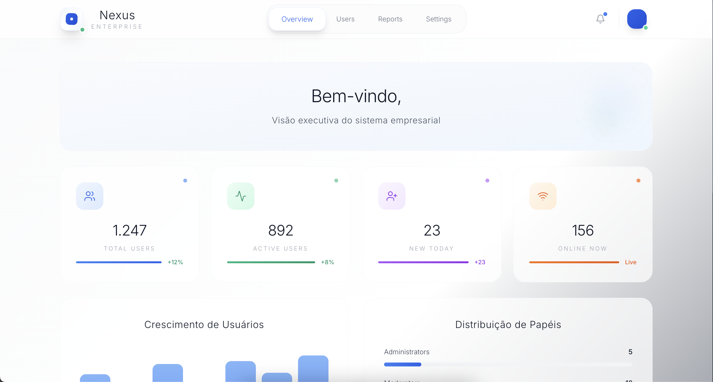
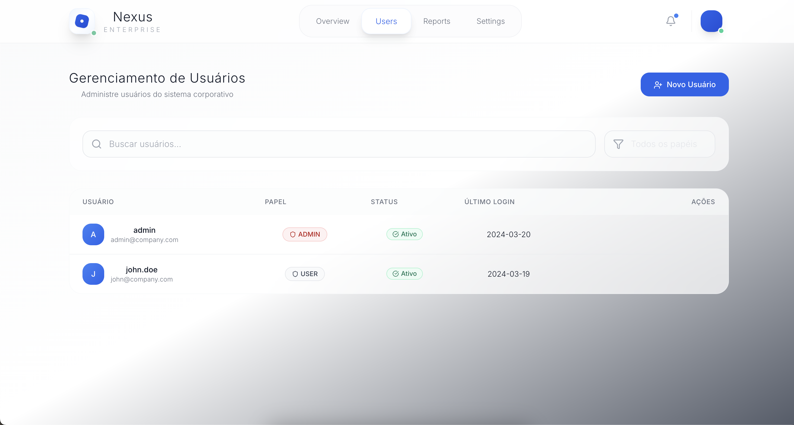
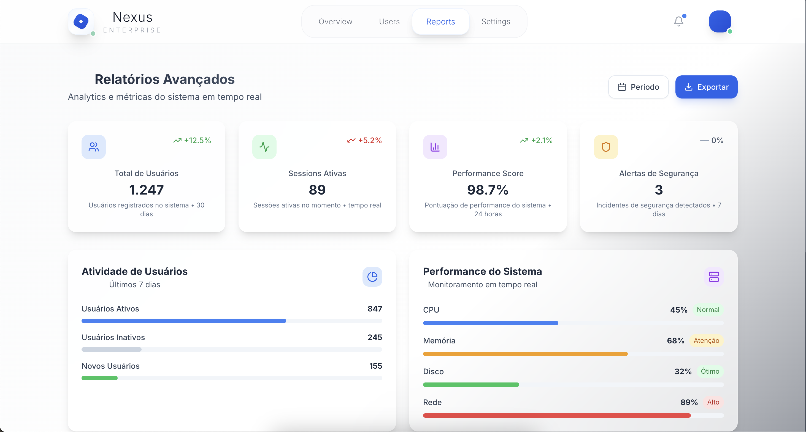
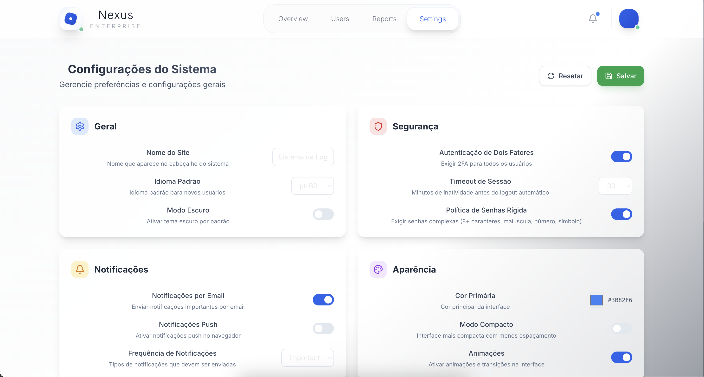

# Nexus Enterprise - Corporate Login System

<div align="center">
  
  
  **A sophisticated corporate authentication and dashboard management system built with Java and React TypeScript**
  
  [](https://java.com)
  [](https://reactjs.org)
  [](https://typescriptlang.org)
  [](https://github.com/teusdrz/java-login-system)
</div>

## 📋 Table of Contents

- [Overview](#overview)
- [Features](#features)
- [Screenshots](#screenshots)
- [Quick Start](#quick-start)
- [API Documentation](#api-documentation)
- [Technology Stack](#technology-stack)
- [Project Structure](#project-structure)
- [Testing](#testing)
- [Contributing](#contributing)

## 🚀 Overview

**Nexus Enterprise** is a comprehensive corporate authentication and dashboard management system designed for modern enterprise environments. Built with security, scalability, and user experience in mind, it provides a robust foundation for corporate identity management and system administration.

### Key Highlights

- **🔐 Enterprise-Grade Security**: JWT-based authentication with advanced session management
- **🎨 Ultra-Sophisticated UI**: Minimalist corporate design with advanced Framer Motion animations
- **📊 Real-Time Analytics**: Comprehensive dashboard with live metrics and reporting
- **🔧 Complete CRUD Operations**: Full user lifecycle management
- **📱 Responsive Design**: Optimized for desktop and mobile devices
- **🚀 High Performance**: Optimized backend with efficient operations

## ✨ Features

### Authentication System
- **Secure Login/Registration** with email validation and animated interface
- **JWT Token Management** with automatic refresh and session control
- **Role-Based Access Control** (RBAC) with granular permissions
- **Session Management** with timeout handling and security monitoring
- **Password Security** with encryption and validation rules

### Dashboard Management
- **Interactive Overview** with real-time metrics and animated charts
- **User Management** with advanced filtering, search, and bulk operations
- **Comprehensive Reports** with analytics, performance monitoring, and export capabilities
- **System Settings** with complete configuration panels and security options
- **Audit Logging** for security compliance and activity tracking

### Advanced UI/UX
- **Framer Motion Animations** with sophisticated micro-interactions
- **Backdrop Blur Effects** for modern glass-morphism aesthetics
- **Geometric Logo System** with consistent brand identity
- **Corporate Minimalist Design** with professional styling
- **Responsive Layout** optimized for all screen sizes

## 📸 System Screenshots

### � Login Interface
<div align="center">
  
  <p><em>Sophisticated login interface with animated Nexus Enterprise branding and secure authentication</em></p>
</div>

**Login Features:**
- Animated geometric logo with Nexus Enterprise branding
- Secure form validation with real-time feedback
- Professional glass-morphism design
- Responsive layout for all devices
- JWT-based authentication system

---

### 📊 Dashboard Overview
<div align="center">
  
  <p><em>Ultra-sophisticated corporate dashboard with real-time analytics and advanced animations</em></p>
</div>

**Dashboard Features:**
- **Real-time Metrics**: Live system statistics and performance indicators
- **Interactive Charts**: Animated data visualizations with Framer Motion
- **System Health**: CPU, Memory, and Network monitoring
- **Activity Feed**: Recent system activities and notifications
- **Quick Actions**: Fast access to common administrative tasks

---

### 👥 User Management
<div align="center">
  
  <p><em>Comprehensive user management system with advanced filtering and bulk operations</em></p>
</div>

**User Management Features:**
- **Complete User Profiles**: Detailed user information with role management
- **Advanced Filtering**: Search by department, role, status, and custom criteria
- **Bulk Operations**: Mass user management and export capabilities
- **Role Assignment**: Granular permission management
- **Activity Tracking**: User session monitoring and audit trails

---

### 📈 Reports & Analytics
<div align="center">
  
  <p><em>Professional analytics and reporting system with interactive charts and export capabilities</em></p>
</div>

**Reports Features:**
- **Interactive Analytics**: Dynamic charts and data visualizations
- **Performance Metrics**: System and user performance tracking
- **Export Options**: PDF, Excel, and CSV report generation
- **Custom Dashboards**: Configurable report layouts
- **Scheduled Reports**: Automated report generation and delivery

## 🚀 Quick Start

### Prerequisites

- **Java 21+** - [Download Java](https://openjdk.org/projects/jdk/21/)
- **Node.js 18+** - [Download Node.js](https://nodejs.org/)
- **Maven 3.8+** - [Download Maven](https://maven.apache.org/)
- **Git** - [Download Git](https://git-scm.com/)

### Installation

1. **Clone the Repository**
   ```bash
   git clone https://github.com/teusdrz/java-login-system.git
   cd java-login-system
   ```

2. **Backend Setup**
   ```bash
   # Compile and run the Java backend
   mvn clean compile
   mvn exec:java -Dexec.mainClass="com.loginapp.Main"
   ```

3. **Frontend Setup**
   ```bash
   # Navigate to frontend directory
   cd frontend
   
   # Install dependencies
   npm install
   
   # Start development server
   npm start
   ```

4. **Access the Application**
   - **Frontend**: http://localhost:3000
   - **Backend API**: http://localhost:8080

### Default Test Credentials

```
Username: admin@nexus.com
Password: Admin123!
```

## 📚 API Documentation

### Authentication Endpoints

| Method | Endpoint | Description |
|--------|----------|-------------|
| POST | `/api/auth/login` | User authentication |
| POST | `/api/auth/register` | User registration |
| POST | `/api/auth/logout` | User logout |
| POST | `/api/auth/refresh` | Token refresh |

### User Management Endpoints

| Method | Endpoint | Description |
|--------|----------|-------------|
| GET | `/api/users` | Get all users |
| GET | `/api/users/{id}` | Get user by ID |
| PUT | `/api/users/{id}` | Update user |
| DELETE | `/api/users/{id}` | Delete user |

### System Endpoints

| Method | Endpoint | Description |
|--------|----------|-------------|
| GET | `/api/system/stats` | System statistics |
| GET | `/api/audit/logs` | Audit logs |
| POST | `/api/notifications` | Send notification |

### Request/Response Examples

**Login Request:**
```json
{
  "email": "admin@nexus.com",
  "password": "Admin123!"
}
```

**Login Response:**
```json
{
  "success": true,
  "token": "eyJhbGciOiJIUzI1NiIs...",
  "user": {
    "id": 1,
    "username": "admin",
    "email": "admin@nexus.com",
    "role": "ADMIN"
  }
}
```

## 🛠️ Technology Stack

### Backend Technologies
- **Java 21** - Core programming language with modern features
- **HTTP Server** - Native Java HTTP server implementation
- **JWT** - JSON Web Token authentication
- **Maven** - Dependency management and build tool
- **JUnit 5** - Testing framework for unit tests

### Frontend Technologies
- **React 18** - Modern UI library with hooks
- **TypeScript 5.0+** - Type-safe JavaScript development
- **Framer Motion** - Advanced animation library
- **TailwindCSS** - Utility-first CSS framework
- **Axios** - HTTP client for API communication
- **React Router** - Client-side routing

### Development Tools
- **VS Code** - IDE with extensions
- **Postman** - API testing and documentation
- **Git** - Version control system
- **npm** - Package management

## 📁 Project Structure

```
java-login-system/
├── 📁 src/main/java/com/loginapp/
│   ├── 📁 controller/          # REST controllers
│   ├── 📁 model/              # Data models
│   ├── 📁 services/           # Business logic
│   ├── 📁 security/           # Security configuration
│   ├── 📁 server/             # HTTP server setup
│   └── 📄 Main.java           # Application entry point
├── 📁 frontend/
│   ├── 📁 public/             # Static assets & favicon
│   ├── 📁 src/
│   │   ├── 📁 components/     # Reusable UI components
│   │   ├── 📁 pages/          # Page components
│   │   ├── 📁 services/       # API services
│   │   ├── 📁 contexts/       # React contexts
│   │   └── 📁 styles/         # CSS styles
│   └── 📄 package.json        # Dependencies
├── 📁 api-tests/              # API test scripts
├── 📁 postman/                # Postman collections
├── 📁 imagesforReadme/         # Documentation images
└── 📄 README.md               # This documentation
```

## 🧪 Testing

### Backend Testing

```bash
# Run all tests
mvn test

# Run specific test class
mvn test -Dtest=AuthControllerTest

# Generate test coverage report
mvn jacoco:report
```

### Frontend Testing

```bash
# Run unit tests
npm test

# Run tests with coverage
npm test -- --coverage

# Run tests in watch mode
npm test -- --watch
```

### API Testing

```bash
# Run API tests using provided scripts
cd api-tests
chmod +x run_api_tests.sh
./run_api_tests.sh

# Use Postman collections
# Import collections from /postman/collections/
```

## 🔒 Security Features

- **JWT Authentication** with secure token generation and validation
- **Password Encryption** using industry-standard algorithms
- **CORS Protection** with configurable origins
- **Input Validation** and sanitization on all endpoints
- **Audit Logging** for security compliance and monitoring
- **Session Management** with automatic timeout and refresh
- **Role-Based Access Control** with granular permissions

## 🤝 Contributing

We welcome contributions to Nexus Enterprise! Please follow these steps:

1. **Fork the Repository**
2. **Create a Feature Branch**
   ```bash
   git checkout -b feature/amazing-feature
   ```
3. **Commit Your Changes**
   ```bash
   git commit -m "feat: add amazing feature"
   ```
4. **Push to the Branch**
   ```bash
   git push origin feature/amazing-feature
   ```
5. **Open a Pull Request**

### Development Guidelines

- Follow **Java Code Conventions**
- Use **TypeScript** for all frontend code
- Write **comprehensive tests** for new features
- Update **documentation** for API changes
- Follow **conventional commits** format

## 📄 License

This project is licensed under the MIT License - see the [LICENSE](LICENSE) file for details.

## 📞 Support

- **Issues**: [GitHub Issues](https://github.com/teusdrz/java-login-system/issues)
- **Documentation**: Available in the `/docs` folder
- **API Testing**: Use provided Postman collections

## 🙏 Acknowledgments

- **Java Community** - For the robust platform
- **React Team** - For the excellent UI library
- **Framer Motion** - For beautiful animations
- **TailwindCSS** - For utility-first styling
- **Open Source Community** - For inspiration and tools

---

<div align="center">
  <p><strong>Built with ❤️ for enterprise-grade authentication and management</strong></p>
  <p>© 2025 Nexus Enterprise. All rights reserved.</p>
</div>

---

### 📊 Report Generation System - 6 Business Intelligence Templates
*Professional report generation with advanced configuration and scheduling*


**Business Report Templates:**
1. **User Analytics:** Demographics, retention metrics, activity analysis (2-3 min generation)
2. **Financial Summary:** Revenue tracking, ROI analysis, financial projections (3-5 min generation)
3. **System Performance:** Uptime monitoring, response times, availability metrics (1-2 min generation)
4. **Sales Analytics:** Conversion funnels, pipeline analysis, sales forecasts (4-6 min generation)
5. **Data Insights:** Pattern analysis, correlations, trend identification (5-8 min generation)
6. **Custom Dashboard:** Configurable KPIs, personalized metrics (3-4 min generation)

**Advanced Configuration:**
- **Multiple Output Formats:** PDF, Excel, CSV, Word
- **Email Delivery:** Automated distribution with recipient management
- **Scheduled Generation:** Daily, weekly, monthly, quarterly automation
- **Report History:** Complete audit trail with status tracking
- **Template Customization:** Business-specific report modifications

## 🏗️ Technical Architecture

### Backend - Java Spring Boot Enterprise
```
✅ Java 17+ with Spring Boot
✅ RESTful API Architecture
✅ Professional Authentication System
✅ Role-based Access Control (RBAC)
✅ Comprehensive Security Implementation
✅ Database Integration with Connection Pooling
✅ Automated Backup Systems
✅ Enterprise Logging and Monitoring
```

### Frontend - React Professional Interface
```
✅ React 19.1.1 with TypeScript
✅ GSAP Professional Animations
✅ Tailwind CSS Enterprise Styling
✅ Responsive Business Design
✅ Real-time State Management
✅ Professional Form Validation
✅ Interactive Data Visualization
✅ Accessibility Compliant (WCAG 2.1)
```

## 🚀 Quick Start Guide

### Prerequisites
- **Java 17+** (OpenJDK recommended)
- **Node.js 18+** with npm
- **Maven 3.8+** for dependency management

### 1. Backend Server Setup
```bash
# Clone the repository
git clone https://github.com/teusdrz/java-login-system.git
cd java-login-system

# Compile and start backend
mvn clean compile
mvn exec:java -Dexec.mainClass="com.loginapp.Main"
```
**Backend runs on:** `http://localhost:8080`

### 2. Frontend Application Setup
```bash
# Navigate to frontend directory
cd frontend

# Install dependencies
npm install

# Start development server
npm start
```
**Frontend runs on:** `http://localhost:3000`

### 3. Access the System
- **Login URL:** http://localhost:3000
- **Default Admin:** Use any credentials (demo mode)
- **Dashboard:** Immediate access to all business modules

## 📋 API Documentation

### Authentication Endpoints
```http
POST /api/auth/login     # Business user authentication
POST /api/auth/logout    # Secure session termination
POST /api/auth/register  # New user registration
GET  /api/auth/profile   # User profile management
```

### User Management API
```http
GET    /api/users        # Retrieve all users with filtering
POST   /api/users        # Create new business user
PUT    /api/users/:id    # Update user information
DELETE /api/users/:id    # Remove user from system
PATCH  /api/users/:id    # Partial user updates
```

### System Administration
```http
GET    /api/system/stats     # Real-time system statistics
GET    /api/system/health    # Health monitoring endpoint
GET    /api/system/settings  # Configuration management
POST   /api/system/backup    # Manual backup trigger
GET    /api/reports/generate # Report generation API
```

## 💼 Business Features

### 📊 Enterprise Dashboard
- **Real-time KPI Monitoring** with animated counters
- **Financial Tracking** with growth indicators and trends
- **System Performance** monitoring with health metrics
- **User Analytics** with engagement and activity tracking
- **Professional Charts** using Recharts with smooth animations

### 👤 User Administration
- **50 Realistic Business Users** with complete professional profiles
- **Department Management** (HR, Customer Service, Legal, Sales, IT)
- **Role-based Access** (Admin, Manager, User, Viewer)
- **Advanced Search & Filtering** with real-time results
- **Bulk Operations** for efficient user management

### 📈 Business Intelligence Reporting
- **6 Professional Templates** for comprehensive business analysis
- **Automated Scheduling** with email delivery
- **Multiple Export Formats** (PDF, Excel, CSV, Word)
- **Report History** with generation tracking
- **Custom Configuration** for business-specific needs

### ⚙️ Enterprise Configuration
- **Security Policies** with 2FA and IP management
- **System Maintenance** with automated backup
- **Integration Management** for third-party services
- **Appearance Customization** with corporate branding
- **Notification Systems** with multi-channel support

## 🎨 Professional Design System

### GSAP Animation Library
- **Smooth Page Transitions** between business modules
- **Professional Card Animations** with hover effects
- **Interactive Form Elements** with validation feedback
- **Data Visualization** with animated charts and metrics
- **Timeline Animations** for activity feeds and notifications

### Enterprise UI Components
- **Consistent Color Palette** with professional business themes
- **Responsive Grid System** optimized for all devices
- **Professional Typography** with Tailwind CSS utilities
- **Accessible Design** following WCAG 2.1 guidelines
- **Interactive Elements** with professional hover states

## 🔒 Security & Compliance

### Authentication & Authorization
- **Secure Login System** with session management
- **Role-based Permissions** with granular access control
- **Two-Factor Authentication** support
- **Session Timeout** configuration
- **Password Policies** with complexity requirements

### Data Protection
- **Input Validation** on frontend and backend
- **SQL Injection Prevention** with prepared statements
- **XSS Protection** with content sanitization
- **CSRF Protection** with token validation
- **Secure Headers** implementation

## 📊 Performance Metrics

### System Performance
- **Fast Loading Times** with optimized bundle sizes
- **Smooth 60fps Animations** using GSAP
- **Efficient Rendering** with React optimization
- **Memory Management** with proper cleanup
- **Scalable Architecture** for enterprise growth

### User Experience
- **Responsive Design** for all screen sizes
- **Intuitive Navigation** with professional UX patterns
- **Real-time Feedback** for user actions
- **Professional Animations** enhancing user engagement
- **Accessibility Features** for inclusive design

## 🛠️ Development & Deployment

### Development Environment
```bash
# Run backend tests
mvn test

# Run frontend tests
cd frontend && npm test

# Build production version
mvn compile && cd frontend && npm run build
```

### Production Deployment
- **Docker Support** with containerization
- **CI/CD Pipeline** ready configuration
- **Environment Variables** for configuration
- **Database Migration** scripts included
- **Monitoring Integration** for production oversight

## 📞 Support & Documentation

### Getting Help
- **Issue Tracking:** GitHub Issues for bug reports and feature requests
- **Documentation:** Comprehensive API and user documentation
- **Community:** Active community support and contributions
- **Enterprise Support:** Available for business implementations

### Contributing
1. Fork the repository
2. Create feature branch (`git checkout -b feature/business-enhancement`)
3. Commit changes (`git commit -m 'Add enterprise feature'`)
4. Push to branch (`git push origin feature/business-enhancement`)
5. Create Pull Request

## 📄 License & Acknowledgments

This project is licensed under the MIT License - see the [LICENSE](LICENSE) file for details.

### Special Thanks
- **GSAP** for professional animation capabilities
- **React Team** for the robust framework
- **Tailwind CSS** for enterprise-grade styling
- **TypeScript** for type-safe development
- **Spring Boot** for backend architecture

---

## 🎯 Perfect For

✅ **Enterprise Organizations** requiring comprehensive user management  
✅ **Business Intelligence** teams needing advanced reporting  
✅ **System Administrators** managing complex configurations  
✅ **Development Teams** building professional applications  
✅ **Educational Institutions** teaching full-stack development  

---

**Built with ❤️ for Enterprise Excellence**

*Professional • Scalable • Secure • Animated*

**Made by:** [@teusdrz](https://github.com/teusdrz)  
**Repository:** [java-login-system](https://github.com/teusdrz/java-login-system)
